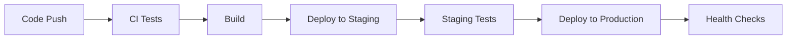

## Testing and Deployment

Final testing phase and production deployment setup.

### Testing Checklist

#### Automated Testing
- [ ] Unit tests for all critical functions
- [ ] Integration tests for API endpoints
- [ ] E2E tests for user workflows
- [ ] Performance testing
- [ ] Security testing

#### Manual Testing
- [ ] Cross-browser compatibility
- [ ] Mobile responsiveness
- [ ] Accessibility testing
- [ ] User acceptance testing
- [ ] Load testing

### Deployment Pipeline

### Infrastructure

- **Hosting**: AWS/Vercel for frontend, Railway/Heroku for backend
- **Database**: PostgreSQL with automated backups
- **CDN**: CloudFront for static asset delivery
- **Monitoring**: Application performance monitoring
- **Logging**: Centralized logging with error tracking

### Go-Live Checklist

- [ ] Domain name and SSL certificates
- [ ] Database migration scripts
- [ ] Environment variables configured
- [ ] Monitoring and alerts set up
- [ ] Backup and recovery procedures
- [ ] Documentation updated
- [ ] Team training completed

### Post-Launch

- Monitor application performance
- Gather user feedback
- Plan iteration improvements
- Security updates and maintenance

This marks the completion of our web development project! 🚀
